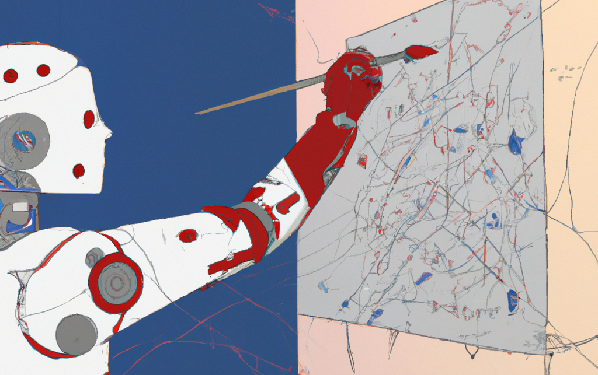

# Extreme bar crawl

**tags:** *REST API, optimisation, geographical, traveling salesperson, Ghent*

## 1. Abstract
Day 3 of the Julia doctoral schools is actually a cover to explore some of Ghent’s amazing bars. An efficient algorithm will be developed for computing the ideal bar crawl route, starting at the closest available rental bicycle. Using optimization techniques and real-time API data, the goal is to enhance the overall bar crawl experience by minimizing travel time. [Ghent's Open Data Portal](https://data.stad.gent/) will be used to obtain an up-to-date overview of the bars and real-time availability of bicycles in a [bicycle-sharing system](https://en.wikipedia.org/wiki/Bicycle-sharing_system).

## 2. Background

**RESTful API:**

A RESTful API is like a set of rules that helps different web applications talk to each other. It treats things, like users or posts, as resources and uses standard methods (GET, POST, PUT, DELETE) for actions. APIs enable efficient access to data, offering real-time updates and better security through authentication. APIs allow selective access to specific data in contrast to downloading entire files.

**Bar crawls:**

A bar crawl is a social activity where a group of people moves from one bar to another. The goal is to explore various establishments, enjoy the atmosphere, and have a good time with friends. Bar crawls are often organized for special occasions like birthdays, bachelor or bachelorette parties, or during doctoral schools. Participants may follow a planned route or spontaneously choose bars along the way, creating a dynamic and lively experience as they hop from one location to another.

**Travelling salesperson problem:**

The Traveling Salesperson Problem (TSP) is a classic optimization problem aiming to find the shortest route that visits each location exactly once while returning to the starting point. 

The TSP is an NP-hard problem, meaning that there is no known polynomial-time algorithm that can solve it for all possible inputs. As the number of location increases, the number of possible routes grows factorially, making it computationally infeasible to check all possible solutions for large instances.

Several approaches and algorithms have been proposed to tackle the TSP. It's important to note that the choice of algorithm depends on factors such as the size of the problem instance, the desired level of optimality and the available computational resources. In practice, heuristic and approximation algorithms are often employed for large-scale TSP instances. 

## 3. Assignments
1. Fetch the bars in Ghent from [Ghent’s data portal](https://data.stad.gent/explore/dataset/cafes-gent/), the API is [documented](https://data.stad.gent/explore/dataset/cafes-gent/api/).  `HTTP.jl` can be used to call the [API endpoint](https://www.notion.so/5744662fff9641a990a40f00ce3948db?pvs=21). Be aware that the default number of bars returned per request is 20, the maximal number of records that can be fetched per API call is 100. This is achieved by defining the `limit` -parameter (`?limit=100`). The `offset`-parameter can be used to request the next 20 records (if `limit` is set, it defines the number of records for each offset). To fetch all the records in the database, multiple API calls need to be performed with an increasing offset until all records have been fetched.
   
2. Plot the bars, the bicycles and the faculty (This snippet constructs a `Plots.jl`-plot with the background map and streets of Ghent (**TODO**))
   
3. To optimise the bar crawl, starting at the Faculty *(51.0529, 3.7093)*, determine the minimal distance travelled (Bird’s eye distance) to visit all bars and return to the faculty. This TSP problem is NP-hard, which means it is impossible to find an exact solution for all bars. 
-   First, write a program to estimate for how many bars it is still computionally feasible (brute-force) to compute an exact solution to this problem.   
-   Based on that number (*X*), sort the bars based on the distance to the faculty, compute the optimal route to visit (*X*-closest bars) and visualise this route on the map. 

4. *\[Optional\]* To increase the scope of the bar crawl find an optimal solution to the closest 25 bars using non-exact solutions. (**TODO**)

5. *\[Optional\]*: Fetch the available bicycles from the [“BAQME available bicycles endpoint”](https://data.stad.gent/api/explore/v2.1/catalog/datasets/baqme-locaties-vrije-deelfietsen-gent/records?) and plot on the map. (**TODO**)

## 4. Resources
- DrWatson.js - Introduction ([source](https://juliadynamics.github.io/DrWatson.jl/dev/))
- Julia documentation ([source](https://docs.julialang.org/en/v1/))
- (**TODO**)
